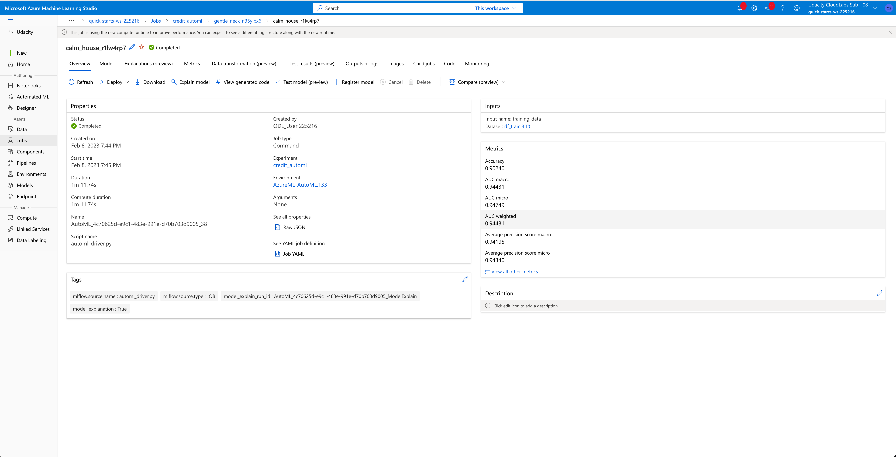

# Capstone Project - Azure Machine Learning Engineer

## Introduction
In this capstone, I have trained two ml models to perform a classification task and compare their accuracies.
1. AutoML model: Trained using AutoML.
2. HyperDrive model: Logistic Regression with hyperparameters tuned using HyperDrive.

I have used an external dataset in my workspace, trained the models using the 
different tools available in the AzureML framework as well as to deploy the best performing model as a web service.

## Dataset

### Overview

The credit approval data is taken from UCI data repository. We will use the data to train the model and predict to approve credit or not.

All attribute names and values have been changed to meaningless symbols to protect confidentiality of the data.

This dataset is interesting because there is a good mix of attributes -- continuous, nominal with small numbers of values, and nominal with larger numbers of values. There are also a few missing values.

Attribute Information:

1. A1: b, a.
2. A2: continuous.
3. A3: continuous.
4. A4: u, y, l, t.
5. A5: g, p, gg.
6. A6: c, d, cc, i, j, k, m, r, q, w, x, e, aa, ff.
7. A7: v, h, bb, j, n, z, dd, ff, o.
8. A8: continuous.
9. A9: t, f.
10. A10: t, f.
11. A11: continuous.
12. A12: t, f.
13. A13: g, p, s.
14. A14: continuous.
15. A15: continuous.
16. A16: +,- (class attribute){+: approved, -: rejected}

Data has 296 approved and 357 rejected applications.

This dataset is public and available for research. Dua, D. and Graff, C. (2019). UCI Machine Learning Repository [http://archive.ics.uci.edu/ml]. Irvine, CA: University of California, School of Information and Computer Science.

*Figure 1: Wine Quality Data*

## Automated ML

I set the following AutoML parameters: 

* The experiment_timeout_minutes (20 mins), iterations (50) and enable_early_stopping to reduce time taken for model training.
* Enabling early stopping allows the training process to conclude if there is no considerable improvement to the primary_metric.
* cross_validations: 5 is set to prevent overfitting.
* The max_concurrent_iterations: 4 is used to allow jobs to be run in parallel on each node.

### Results

The best performing model from AutoML was the Voting Ensumble method. The accuracy of this model was
90.24%. 

* Disable early stopping, increase the number of cross validations and max_iterations allowing AutoML to evaluate more 
models and avoid overfitting.

* Change my target metric to Recall, Precision, F-Score,... depending on considerations of confusion matrix preferences.
* Enable featurization to generate custom features.

*Figure 2: AutoML Best Model*

*Figure 3: AutoML Best Model Parameters*

*Figure 4: AutoML Model List*

*Figure 5: AutoML Model RunDetails*

## Hyperparameter Tuning

I used a Logistic Regression Classifier from Sklearn. My predictive task was binary classification and this model was 
appropriate. 

I chose to use tune 3 hyperparameters:

* *C*: Inverse of regularization strength; must be a positive float. Like in support vector machines, 
smaller values specify stronger regularization.
* *max_iter*: Maximum number of iterations taken for the solvers to converge.
* *solver*: Algorithm to use in the optimization problem.

 
I used a RandomParameterSampling instead of an exhaustive GridSearch to reduce compute resources and time. This approach 
gives close to as good hyperparameters as a GridSearch with considerably less resources and time consumed. 

I used a BanditPolicy and set the evaluation_interval to 2 and the slack_factor to 0.1. This policy evaluates the primary 
metric every 2 iteration and if the value falls outside top 10% of the primary metric then the training process will stop. 
This saves time continuing to evaluate hyperparameters that don't show promise of improving our target metric. It prevents 
experiments from running for a long time and using up resources.

I chose the primary metric as Accuracy and to maximize it as part of the Hyperdrive run. 

### Results
The best performing Logistic Regression Model came in with an accuracy of 83.9% which has 6% lower accuracy compared to AutoML model.

*Figure 7: HyperDrive Model*

*Figure 8: HyperDrive Model RunDetails*

*Figure 9: HyperDrive Models Accuracy*

## Model Deployment

As the AutoML classification model out performed tunned Logistical Regression model, I proceeded to deploy this model in Azure.
I obtained the scoring script from the best run as well as used the current environment settings for the deployment. 

I used the code below to deploy the model:

*Figure 10: AutoML Model Deployment*

**Python**: 
I leveraged the *requests* package to POST two JSONs to the service endpoint.

*Figure 11: AutoML Python Interaction*

*Figure 12: AutoML Deployment Logs*

Once I had completed my testing I proceeded to delete the service.

*Figure 13: AutoML Deployment Deletion*

## Screen Recording
https://youtu.be/nSsgSQohesA
